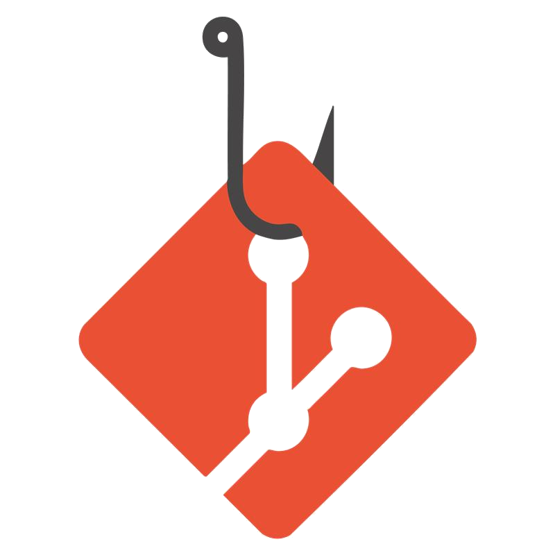

# incolume.py.githooks
<!--


-->
[](https://github.com/astral-sh/ruff)
[](https://github.com/pre-commit/pre-commit)

---

Hooks git for incolume projects.

## Usage

### Configuration

Model for .pre-commit-config.yaml, bellow:

```yaml
# .pre-commit-config.yaml

- repo: https://github.com/astral-sh/ruff-pre-commit
  # Ruff version.
  rev: v0.13.0
  hooks:
    # Run the linter.
    - id: ruff-check
      args: [--config, ruff.toml, --fix ]
    # Run the formatter.
    - id: ruff-format
      args: [--config, ruff.toml]

- repo: https://github.com/development-incolume/incolume.py.githooks
  rev: 1.3.0
  hooks:
    - id: check-precommit-installed
    - id: check-valid-filenames
      args: ['--min-len=3', '--max-len=256']
    - id: detect-key
    - id: effort-message
    - id: footer-signed-off-by
      args: [--signoff]

```
